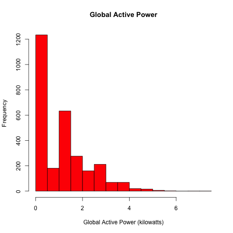

# Exploratory Data Analysis - Project 1
###Colin Lebens

 
## Files

* __loadData.R__: Includes logic for loading source data
* __plot1.R__: Produces first plot
* __plot1.png__: Output of second plot
* __plot2.R__: Produces second plot
* __plot2.png__: Output of second plot
* __plot3.R__: Produces third plot
* __plot3.png__: Output of third plot
* __plot4.R__: Produces fourth plot
* __plot4.png__: Output of fourth plot

## Plot Output

### plot1

### plot2

### plot3

### plot4

